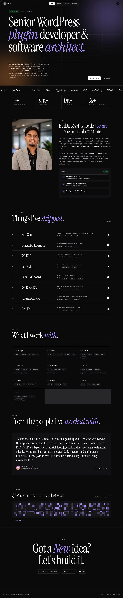
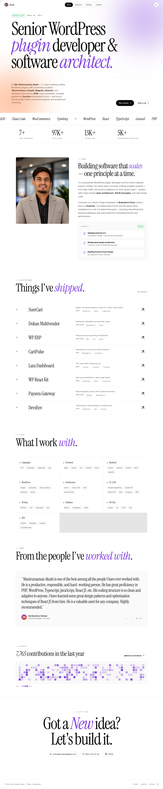
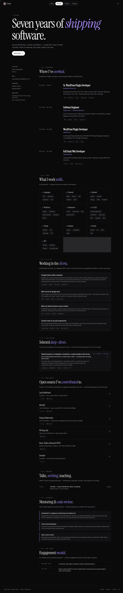
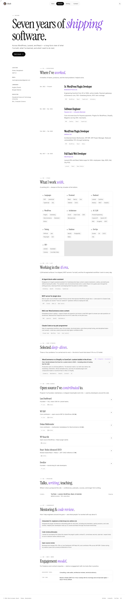
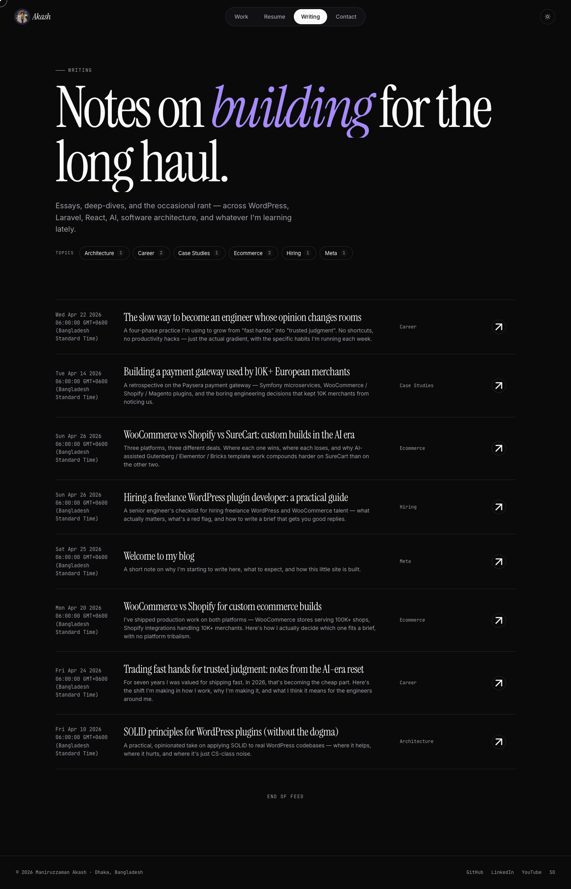
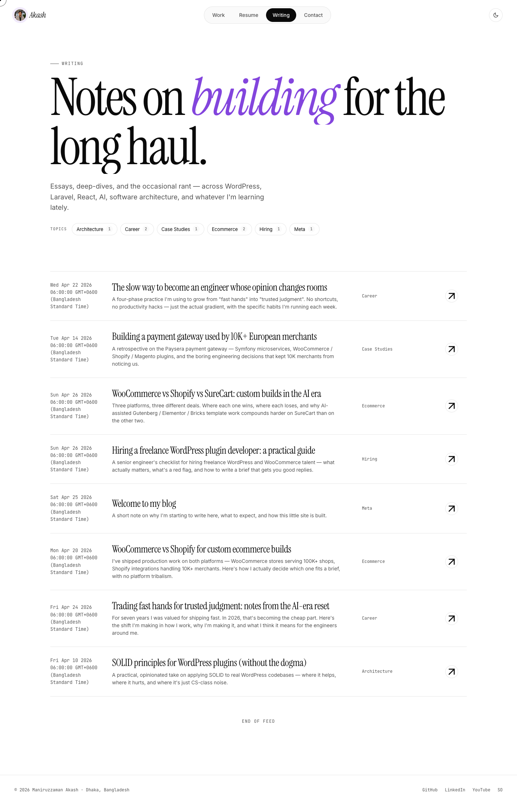
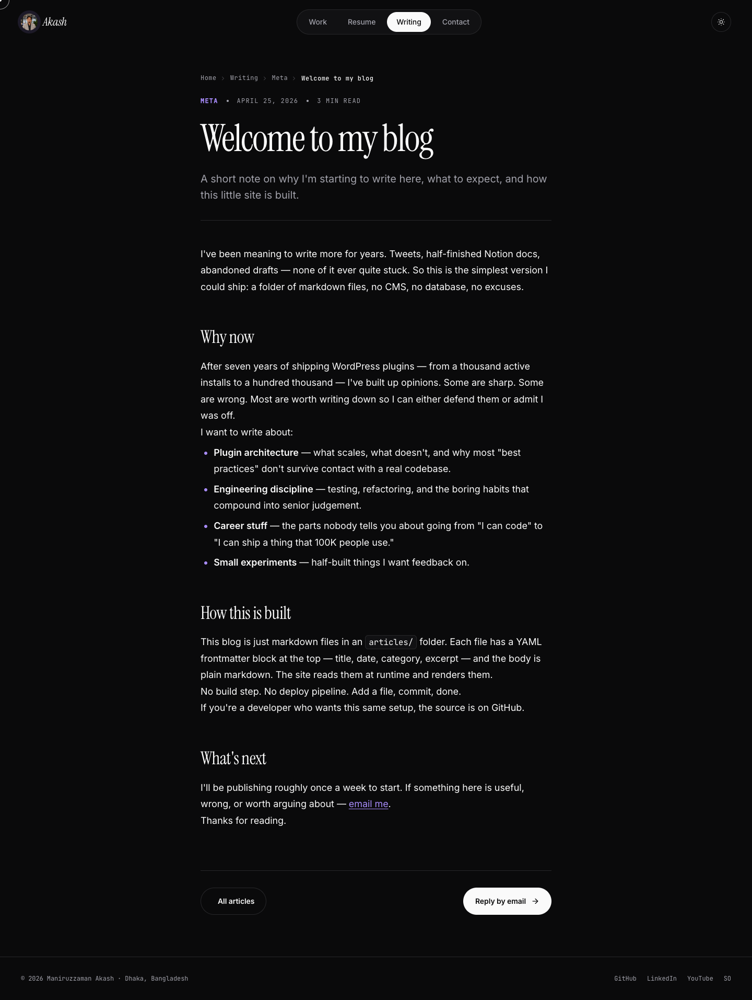
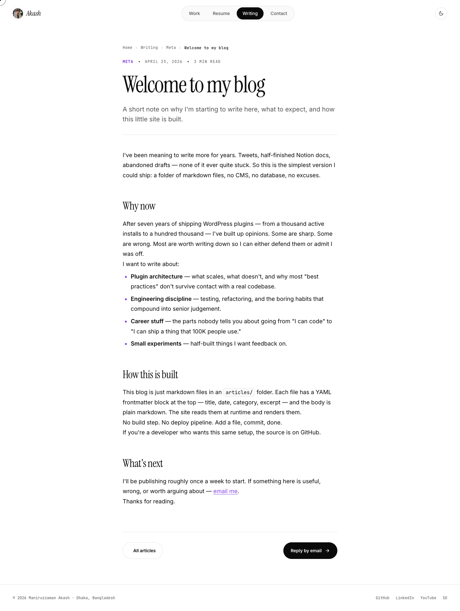
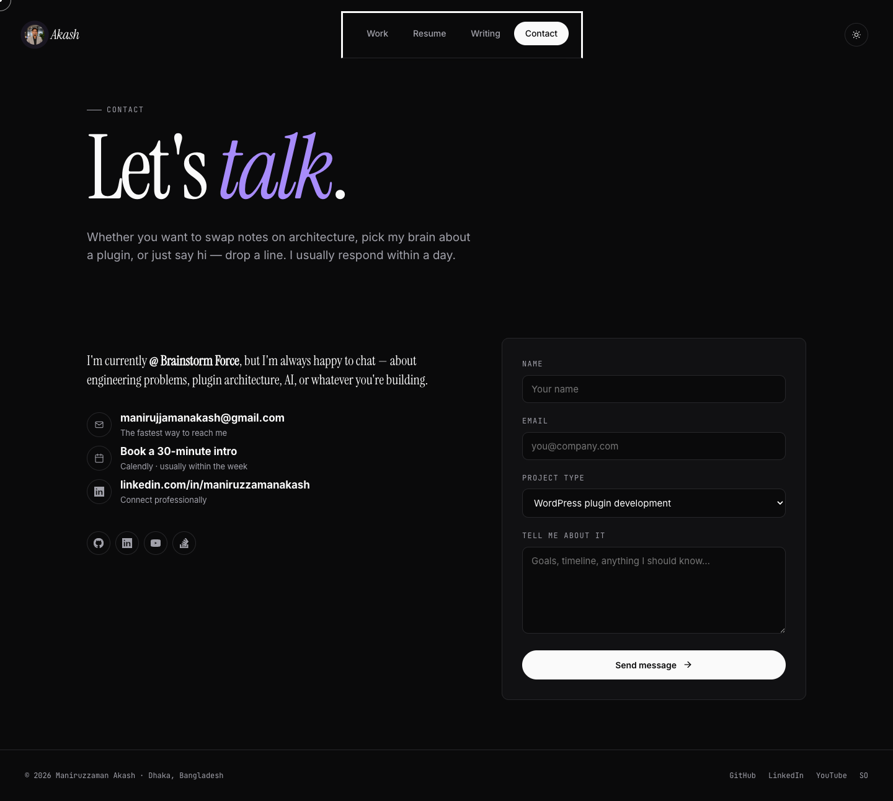
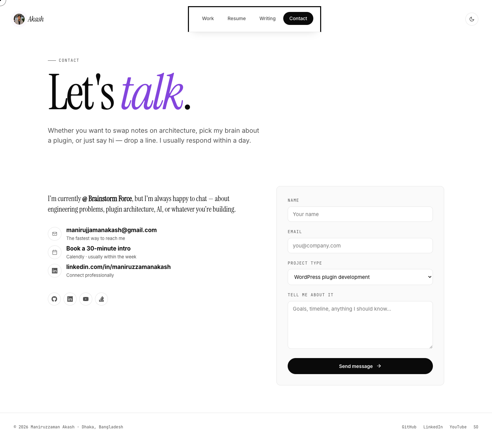

# Maniruzzaman Akash — Portfolio

A personal portfolio + markdown blog for **Md. Maniruzzaman Akash**, built
with **Next.js 14 (App Router) + TypeScript** and statically exported. The
production site is served from GitHub Pages at **[maniruzzaman.me](https://maniruzzaman.me)**.

> **Live:** <https://maniruzzaman.me>
> **Source:** this repository
> **Author guide:** see [CLAUDE.md](./CLAUDE.md) — file map, conventions,
> where-to-edit table, and the article-publishing workflow.

---

## Screenshots

| Dark | Light |
| :---: | :---: |
|  |  |
| _Home_ | _Home_ |
|  |  |
| _Resume_ | _Resume_ |
|  |  |
| _Blog_ | _Blog_ |
|  |  |
| _Article_ | _Article_ |
|  |  |
| _Contact_ | _Contact_ |

> Captured against the dev server at 1440 px wide. Re-generate with the
> command in [`Regenerating screenshots`](#regenerating-screenshots).

---

## How it works

- **Next.js 14 App Router.** Every page under `app/` is a server component
  by default. Components marked `'use client'` are bundled separately and
  hydrate on the client (nav, hero magnet, theme toggle, contact form,
  testimonial carousel).
- **Static export.** `next.config.mjs` sets `output: 'export'` in
  production. `npm run build` pre-renders every public route — including
  each article — into static HTML under `out/`. No Node runtime is needed
  at deploy time.
- **Articles** live in `articles/<slug>.md` with YAML frontmatter. At
  build time, `lib/markdown.ts` reads them via `gray-matter` + `remark`
  + `rehype-prism-plus` and emits one static `index.html` per slug under
  `out/article/<slug>/`. `generateStaticParams` enumerates the slugs.
- **SEO baked in.** `lib/seo.ts` generates per-route `Metadata` (title,
  description, canonical, OG/Twitter Card) plus JSON-LD graphs (Person,
  WebSite, ProfilePage, BlogPosting, FAQPage, BreadcrumbList) from the
  typed `CONTENT` object in `lib/content.ts`.
- **Sitemap + robots** are auto-generated from the same content/articles
  source and emitted at `/sitemap.xml` and `/robots.txt`.
- **Trailing slashes.** `trailingSlash: true` makes every URL end with
  `/` — `/blog/`, `/article/welcome-to-my-blog/` — for friendlier
  static-host routing.

---

## Run locally

```bash
npm install
npm run dev          # → http://localhost:3000
```

Build + verify the static export:

```bash
npm run build        # writes out/
npx serve out        # smoke-test the export locally
```

| Script              | What it does                                          |
| ------------------- | ----------------------------------------------------- |
| `npm run dev`       | Next.js dev server with hot reload                    |
| `npm run build`     | Static export to `out/`                               |
| `npm run start`     | Serve a production build (rarely needed — exports are static) |
| `npm run lint`      | `next lint`                                           |
| `npm run typecheck` | `tsc --noEmit` — strict TypeScript check              |
| `npm run screenshots` | Regenerate README screenshots — needs `npm run dev` running |

Requires **Node ≥ 18.18**.

---

## Project structure

```
.
├── app/                      # App Router routes
│   ├── layout.tsx            # root <html>, global CSS, baseline JSON-LD
│   ├── globals.css           # @imports styles/*.css
│   ├── page.tsx              # /
│   ├── resume/page.tsx       # /resume/
│   ├── blog/page.tsx         # /blog/
│   ├── blog/category/[category]/page.tsx  # /blog/category/<slug>/
│   ├── contact/page.tsx      # /contact/
│   ├── article/[slug]/page.tsx          # /article/<slug>/
│   ├── article/[slug]/opengraph-image.tsx  # per-article OG image
│   ├── sitemap.ts            # /sitemap.xml
│   ├── robots.ts             # /robots.txt
│   └── not-found.tsx         # 404
├── articles/                 # markdown blog content
│   ├── index.json            # ordered list of articles + metadata
│   └── *.md                  # one file per post (YAML frontmatter)
├── components/               # shared components (server + client)
├── lib/
│   ├── content.ts            # CONTENT — single source of truth for copy
│   ├── seo.ts                # buildMetadata + JSON-LD generators
│   ├── markdown.ts           # server-only article reader + categories
│   ├── tmpl.ts               # {token} substitution
│   ├── routing.ts            # pathFor()
│   ├── actions.ts            # action → href resolver
│   ├── calendly.ts           # client-only openCalendly()
│   └── theme.ts              # client useTheme() hook
├── styles/                   # tokens + per-section CSS, imported by globals.css
├── public/
│   ├── assets/               # favicon, OG image, avatar, manifest icons
│   ├── screenshots/          # README screenshots
│   └── manifest.json
├── .github/workflows/deploy.yml  # GitHub Pages CI
├── next.config.mjs           # static export, trailingSlash, etc.
├── CLAUDE.md                 # canonical author guide
└── README.md                 # you are here
```

For the long version (load order, conventions, common-changes table, and
the article workflow), read [CLAUDE.md](./CLAUDE.md).

---

## Routing

| URL                              | File                                       |
| -------------------------------- | ------------------------------------------ |
| `/`                              | `app/page.tsx`                             |
| `/resume/`                       | `app/resume/page.tsx`                      |
| `/blog/`                         | `app/blog/page.tsx`                        |
| `/blog/category/<slug>/`         | `app/blog/category/[category]/page.tsx`    |
| `/article/<slug>/`               | `app/article/[slug]/page.tsx`              |
| `/contact/`                      | `app/contact/page.tsx`                     |
| `/sitemap.xml`                   | `app/sitemap.ts`                           |
| `/robots.txt`                    | `app/robots.ts`                            |

Add a new top-level route by creating its page file under `app/<route>/page.tsx`,
then adding the entry to `CONTENT.navigation` and `CONTENT.seo.routes` in
`lib/content.ts`. The sitemap, breadcrumbs, and nav pick it up automatically.

---

## Make this site yours (rebrand in 5 minutes)

Everything visible on the site flows from `lib/content.ts`. To rebrand,
edit one file — no JSX, no CSS, no component changes.

### 1. Update `CONTENT.site`

```ts
site: {
  name:     'Jane Doe',
  fullName: 'Jane M. Doe',
  short:    'Jane',                  // shown in nav logo
  title:    'Senior Backend Engineer & Systems Designer',
  location: 'Berlin, Germany',
  timezone: 'CET',
  email:    'jane@example.com',
  status:   'Open to chat',          // status pill on hero
  calendly: 'https://calendly.com/jane/chat',
  socials: {
    github:        'https://github.com/janedoe',
    linkedin:      'https://linkedin.com/in/janedoe',
    youtube:       'https://www.youtube.com/@janedoe',
    stackoverflow: 'https://stackoverflow.com/users/123456/jane-doe',
    twitter:       'https://twitter.com/janedoe',
  },
  contributionsLastYear: 1234,
},
```

That single change cascades everywhere: nav logo, footer, mailto links,
GitHub buttons, the hero subtext (uses `{fullName}` token), `{email}` in
contact links — all auto-update.

### 2. Replace structured data

Each list is an array of plain objects. Empty an array to hide its section.

```ts
projects:    [...]   // your work
experience:  [...]   // your job history
skills:      [...]   // your tech clusters
testimonials:[...]   // recommendations
openSource:  [...]   // repos / contributions
stats:       [...]   // headline numbers
marqueeWords:[...]   // tags scrolling across the hero
```

Field shapes are documented in [CLAUDE.md](./CLAUDE.md#editing-content).

### 3. Rewrite the prose

Six blocks under `CONTENT.*` hold every word of editable copy:

```ts
home:    { hero, about, sections, contactCta }
resume:  { hero, aside, sections }
blog:    { hero, loading, feedEnd, empty, error }
article: { backLabel, replyLabel, notFoundHead }
contact: { hero, summary, links, form }
footer:  { copyright, links }
```

Use `*italic*` for accent words, `**bold**` for emphasis, `\n` for line
breaks, and `{key}` to interpolate `CONTENT.site` fields.

### 4. Swap colors / fonts (optional)

`styles/tokens.css` holds every design token — accent, paper, ink,
spacing, radius, fonts. Don't hardcode colors in component styles; always
go through CSS variables.

### 5. Replace the articles

Delete the markdown files in `articles/` and write your own. Update
`articles/index.json` with the new entries. The blog list, category
pages, sitemap, and per-article metadata auto-render from there.

---

## Adding a new article

1. **Create `articles/<slug>.md`** with frontmatter:

   ```markdown
   ---
   title: My new article
   slug: my-new-article
   date: 2026-04-30
   category: Engineering
   excerpt: One-sentence summary that shows up in the blog list.
   readTime: 5 min
   tags: [wordpress, php]
   ---

   Body in plain markdown — GFM works, code blocks get syntax-highlighted
   via rehype-prism-plus.
   ```

2. **Register it in `articles/index.json`**:

   ```json
   {
     "articles": [
       {
         "file":     "my-new-article.md",
         "slug":     "my-new-article",
         "title":    "My new article",
         "date":     "2026-04-30",
         "category": "Engineering",
         "excerpt":  "One-sentence summary that shows up in the blog list."
       }
     ]
   }
   ```

3. Run `npm run build`. The new article gets:
   - A static page at `/article/<slug>/`
   - An entry in `/sitemap.xml`
   - An entry on the `/blog/` listing
   - An auto-derived category page if the category is new
   - A dynamic OG image at `/article/<slug>/opengraph-image`
   - Per-page metadata + Article JSON-LD with `datePublished`,
     `articleSection`, `keywords`

---

## SEO surface

Every page produces:

- `<title>` + `<meta description>` from `CONTENT.seo.routes[<route>]`
- `<link rel="canonical">` (with trailing slash)
- Open Graph + Twitter Card tags (image, locale, type)
- For `/article/<slug>/`: `og:type=article`, `article:published_time`,
  `article:section`, `article:tag`, plus a per-article OG image
- JSON-LD: Person + WebSite from `app/layout.tsx`, plus per-route schemas:
  - `/`: ProfilePage, FAQPage, BreadcrumbList
  - `/resume/`: ProfilePage, BreadcrumbList
  - `/blog/`: Blog (with all posts), BreadcrumbList
  - `/article/<slug>/`: BlogPosting, BreadcrumbList
  - `/contact/`: FAQPage, BreadcrumbList
- `/robots.txt` (allows all major crawlers including AI bots)
- `/sitemap.xml` (auto-generated from articles + routes)

Verify after a build: open any HTML file in `out/` and grep for `og:`,
`application/ld+json`, `<title>`, `<link rel="canonical">`.

---

## Deploy to production

### GitHub Pages (current setup)

The repo ships with [`.github/workflows/deploy.yml`](./.github/workflows/deploy.yml).
On every push to `main` it:

1. Installs deps with `npm ci`
2. Runs `npm run build` (which writes `out/`)
3. Adds `.nojekyll` and a `CNAME` file (`maniruzzaman.me`)
4. Uploads `out/` as a Pages artifact and deploys it to the
   `github-pages` environment

To use this for your own fork, change the domain in
[`.github/workflows/deploy.yml`](./.github/workflows/deploy.yml) (or remove
the `CNAME` step entirely to use the default `<user>.github.io/<repo>` URL),
then push to `main`. The first run auto-enables Pages via
`actions/configure-pages@v5`.

### Vercel

Push to GitHub, import the repo on Vercel — Next.js + the static export
config are auto-detected. No extra configuration needed.

### Cloudflare Pages / Netlify / S3

Run `npm run build` locally (or in CI) and deploy the `out/` directory.

- **Cloudflare Pages:** build command `npm run build`, output dir `out`
- **Netlify:** same — build command `npm run build`, publish dir `out`
- **S3 + CloudFront:** upload `out/` to the bucket; with
  `trailingSlash: true` the index lookups Just Work

---

## Contact form setup

The form on `/contact/` posts to **[Web3Forms](https://web3forms.com)** —
no backend, no serverless function, no account creation. Free tier:
**250 submissions/month** with built-in spam protection. Setup takes
under two minutes.

### 1. Get your access key

Go to [web3forms.com](https://web3forms.com) and submit the email you
want to receive form submissions at. They'll mail you an **access key**
within seconds. There's no signup flow — the inbox itself is the
verification.

### 2. Configure locally

Copy `.env.example` → `.env.local` and paste your key:

```bash
cp .env.example .env.local
```

```env
# .env.local
NEXT_PUBLIC_WEB3FORMS_KEY=your-key-here
```

Run `npm run dev`, fill in the form, hit submit — the message lands in
your inbox.

### 3. Configure for deploys

`NEXT_PUBLIC_*` env vars are baked into the bundle at **build time**, so
the key has to be present when `npm run build` runs in your deploy
pipeline.

| Host                         | Where to add `NEXT_PUBLIC_WEB3FORMS_KEY`                     |
| ---------------------------- | ------------------------------------------------------------ |
| **GitHub Pages** (this repo) | Repo Settings → Secrets → Actions, then expose it via `env:` in [`deploy.yml`](./.github/workflows/deploy.yml) |
| **Vercel**                   | Project Settings → Environment Variables                     |
| **Netlify**                  | Site configuration → Environment variables                   |
| **Cloudflare Pages**         | Project → Settings → Environment variables                   |

For GitHub Pages specifically, add to the build step in
`.github/workflows/deploy.yml`:

```yaml
- run: npm run build
  env:
    NEXT_PUBLIC_WEB3FORMS_KEY: ${{ secrets.NEXT_PUBLIC_WEB3FORMS_KEY }}
```

### Without a key

If `NEXT_PUBLIC_WEB3FORMS_KEY` isn't set, the form falls back to opening
a prefilled `mailto:` draft in the user's mail client — so a freshly
cloned repo still works, just less polished. A small hint appears under
the submit button as a reminder to wire up the key.

### Switching providers

Prefer Formspree, Getform, Basin, Formsubmit, etc.? They all expose the
same shape of HTTP form-relay. Edit
[`components/ContactClient.tsx`](./components/ContactClient.tsx) — change
`WEB3FORMS_ENDPOINT` and the hidden field names; the rest of the
component is provider-agnostic.

---

## Regenerating screenshots

The `public/screenshots/*.png` files in this README are produced by
[`scripts/screenshots.mjs`](./scripts/screenshots.mjs) (Puppeteer +
headless Chrome). To regenerate:

```bash
# in one terminal
npm run dev

# in another, with the dev server live on :3000
npm run screenshots
```

This captures every public route in both themes at 1440 px wide,
full-page, and writes to `public/screenshots/<route>-<theme>.png`.

Override the defaults with env vars when needed:

```bash
SCREENSHOT_ORIGIN=http://localhost:3001 npm run screenshots
CHROME_PATH=/path/to/chrome              npm run screenshots
```

The script uses `puppeteer-core` (a devDependency), which doesn't bundle
Chromium — it drives the system Chrome at `CHROME_PATH` instead.

---

## Tech stack

| Area              | Choice                                              |
| ----------------- | --------------------------------------------------- |
| Framework         | Next.js 14 (App Router)                             |
| Language          | TypeScript (strict)                                 |
| UI                | React 18 server + client components                 |
| Markdown          | unified + remark-parse + remark-gfm + remark-rehype |
| Code highlighting | rehype-prism-plus                                   |
| Frontmatter       | gray-matter                                         |
| Styling           | Plain CSS with CSS custom properties (no preprocessor) |
| Booking           | Calendly widget                                     |
| Fonts             | Inter (sans), Instrument Serif (display), JetBrains Mono (code) |
| Build             | `next build` → static export to `out/`              |
| Hosting           | GitHub Pages (custom domain via `CNAME`)            |
| CI                | GitHub Actions (`.github/workflows/deploy.yml`)     |

---

## Known limitations

- The contact form posts to **[Web3Forms](https://web3forms.com)** when
  `NEXT_PUBLIC_WEB3FORMS_KEY` is configured (see
  [Contact form setup](#contact-form-setup) below). Without a key it
  gracefully falls back to a `mailto:` draft.
- The contributions grid uses `Math.random()` so the rendered activity
  doesn't reflect real GitHub data. Swap in the GitHub GraphQL API for
  live contributions.
- Next.js's image optimizer is disabled (`images.unoptimized = true`)
  because the static export has no Node runtime. Provide pre-sized images
  in `public/` instead of relying on `<Image>` resizing.

---

## License

Code is MIT. Article content is © Maniruzzaman Akash, all rights reserved
(don't republish posts without asking).
